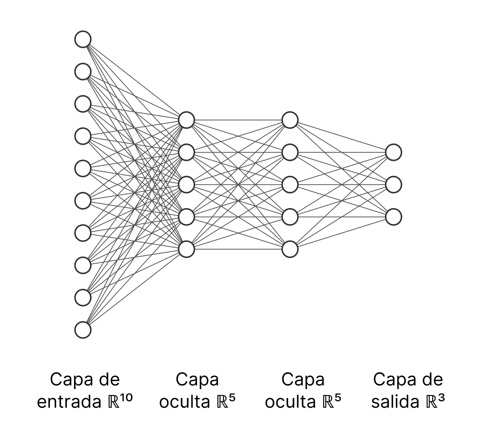
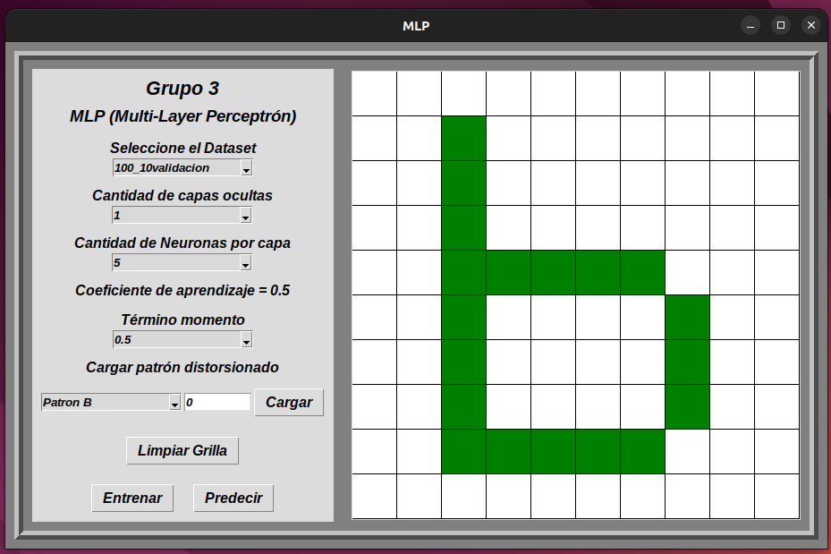
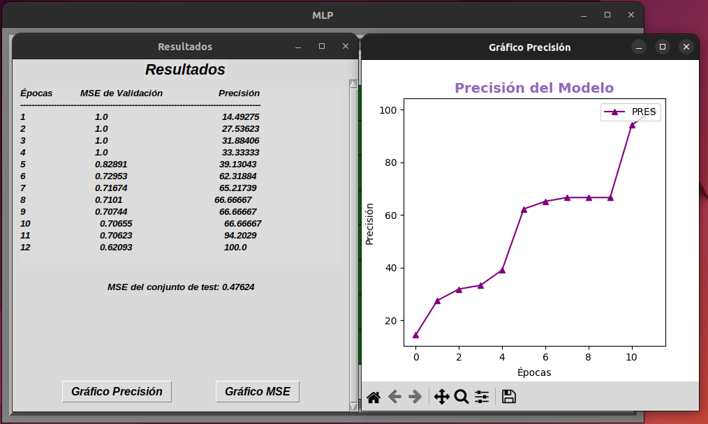
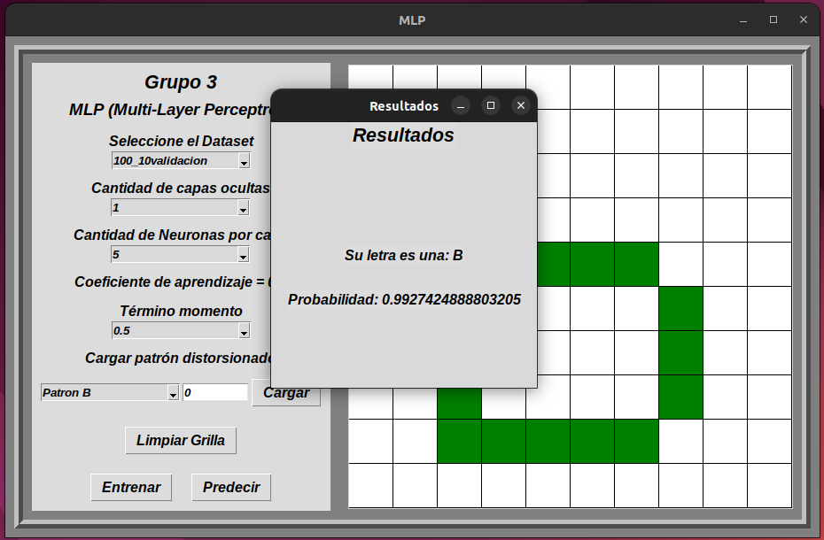

# ANÁLISIS DE UNA MLP (MULTI-LAYER PERCEPTRON)

## Tabla de Contenido

1. [Descripción](#descripcion)
2. [Capaturas de Pantalla](#capturas-de-pantalla)
3. [Pre requisitos](#pre-requisitos)
4. [Instalación](#instalacion)
5. [Anexo](#anexo)
6. [Desarrolladores](#desarrolladores)
7. [Licencia](#licencia)

<a name="descripcion"/>

## 1. Descripción 🚀

Implementación de un MLP (Multi-Layer Perceptrón) para el reconocimiento de caracteres. Podrá elegir la arquitectura con la que desee implementar la red neuronal, seleccionar entre nueve datasets distintos para el entrenamiento. Podrá apreciar los errores (MSE) de validación y precisión del modelo, tanto numéricamente como gráficamente.

<p align="center">
  
</p>

<a name="capturas-de-pantalla"/>

## 2. Capturas de Pantalla 📸

<p align="center">
  
</p>

<p align="center">
  
</p>

<p align="center">
  
</p>

<a name="pre-requisitos"/>

## 3. Pre requisitos 📋

Antes de empezar asegúrese de tener [Python](https://www.python.org/downloads/) en su última versión instalado junto con las siguientes librerías:

- [Matplotlib](https://matplotlib.org/)
- [Tkinter](https://docs.python.org/es/3/library/tkinter.html)
- [Numpy](https://numpy.org/)

<a name="instalacion"/>

## 4. Instalación ⚙️

Siga los siguiente pasos para correr el proyecto:

```
$ git clone https://github.com/William10101995/TPI_MLP_G3.git
$ cd TPI_MLP_G3/
$ python GUI_MLP.py
```

Listo, ya tendrá la aplicación corriendo.

<a name="anexo"/>

## 5. Anexo 📢

- [Manual de Usuario](https://docs.google.com/document/d/19M3iYvb9ULzEZd5bb4UNLF2F1M0wWV1SPfvS3jlY3G0/edit?usp=drivesdk): Lea el manual de usuario para más detalles de cómo funciona el programa.
- [Paper](https://docs.google.com/document/d/17riM6g8YNuGtf7qouLALgSh9Uf-6l2x71wXRPA_4vqo/edit?usp=drivesdk): Lea la investigación realizada para la implementación.
- [Ejecutable](https://drive.google.com/drive/folders/1ucEHDrmnNawJMfwGzA1HhuOt8tj7CZaq): Descargue el ejecutable para Windows.

<a name="desarrolladores"/>

## 6. Desarrolladores ⚡

- [Alaez, Magali](https://github.com/MagaAlaez)
- [Lopez, William](https://github.com/William10101995)
- [Nasir, Khalil](https://github.com/KhalilKAN)
- [Stride, Eric](https://github.com/StrideEric)
- [Troncoso, Clarise](https://github.com/ClariseT)

<a name="licencia"/>

## 7. Licencia ✒️

MIT

**Free Software, Hell Yeah!**
